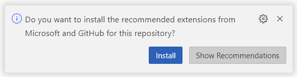
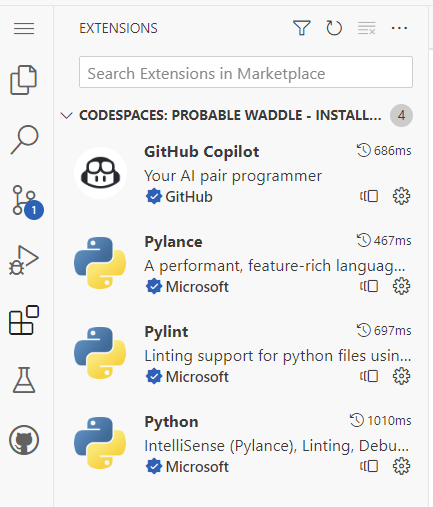

# GitHub Copilot Productivity Study

## Welcome to the study

This study seeks to make a examine the impact on productivity of introducing Copilot for developers.  
To compare productivity of using Copilot two exercises will be solved by a set of developers.

You are inrolled to help by solving two exervices, one using GitHub Copilot and one using all other aids (ie. Google, Stack Overflow) <U>except AI based tools</U>.

See [Development environment](#DevEnvironment) for information about executing the assignment.

## Execution of assignments

Please follow the steps below and make a "commit" when asked (this is in order to isolate certain productivity aspects)

> __Important!__ - If you, while solving the task, need a slightly longer break (>5 min.), then please make a "Start break" commit and an "End break" commit when you begin again.

1. You must first complete a task <U>with GitHub Copilot __disabled__</U>
    1. Go to the folder of the task you are asked to solve first.
    1. __Before reading the requirement make a commit with the message "Requirement Start"__
    1. Read the Assignment file (*.md)
    1. Be aware that there may also be sample input/output files in the folder that you need to use while testing.  
    1. When the exercise introduction is read and understood, write a small text in plain language of your understanding of the assignment in the assignment file.
    1. __After completing the previous task make a commit with the message "Requirement without using Copilot understanded"__
1. Start solving the exercise    
   1. __Before starting to solve the assignment make a commit with the meassage "Start assignment without Copilot"__
   1. We expect you are testing the solution with a test script, but you are free to write the test before or after you solve the problem!
   1. While solving the problem you are free to make a commit as often you want.
   1. __After solving the assignment make a commit with the message "Assignment without using GitHub Copilot Done"__

1. Second exercise will be completed <U>with GitHub Copilot __enabled__</u>
    1. __Before reading the requirement make a commit with the message "Requirement Start"__
    1. Go to the folder of the task you are asked to solve first.
    1. Read the Assignment file (*.md)
    1. Be aware that there may also be sample input/output files in the folder that you need to use while testing.
    1. When the exercise introduction is read and understood, write a small text in plain language of your understanding of the assignment in the assignment file.
    1. __After completing the previous task make a commit with the message "Requirement without using Copilot understanded"__
1. Start solving the next assingment
   1. __Before starting to solve the assignment make a commit with the meassage "Start assignment without Copilot"__    
   1. We expect you are testing the solution with a test script, but you are free to write the test before or after you solve the problem!
   1. While solving the problem you are free to make a commit as often you want.
   1. __After solving the assignment make a commit with the message "Assignment using GitHub Copilot Done"__
1. After completing the two assingment, read and answer the file "End Interview.md".  
__After answering the end interview make a commit with the message "End Interview answered".__
1. Push the repository to your GitHub account  
_We are able to see the content of this repository, but will delete the access as soon we are finish evaluating the result._

## <a name="DevEnvironment"></a> Development environment

When you start GitHub Visual Studio Code in Github Classroom, the editor will prompt you for installing some extensions.  
These extensions are Python and GitHub Code Pilot specific and you are asked to install these when starting the editor.  
>__Tip!__. It has been observed that if you install all the extension at the same time, the installation will take longer time, so it is recommended to install them one at a time.




>__Be aware that the Copilot plugin need to be enabled or disabled depending on what assignement you are on.__

### Start Github Codespaces

You start the GitHub Codespace from the assigned GitHub repository by clicking on the green code button and then click the "Create codespace on ..." button in the Codespaces' tab.


### Python tools

GitHub Codespaces runs on a virtual Linux machine, so it is possible to install extra tools.

For example:
```bash
pip install pytest
```